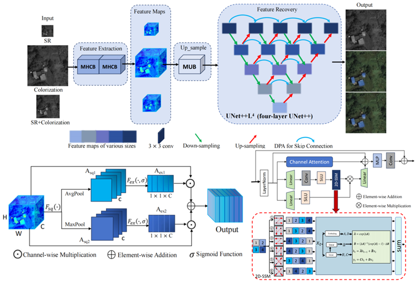
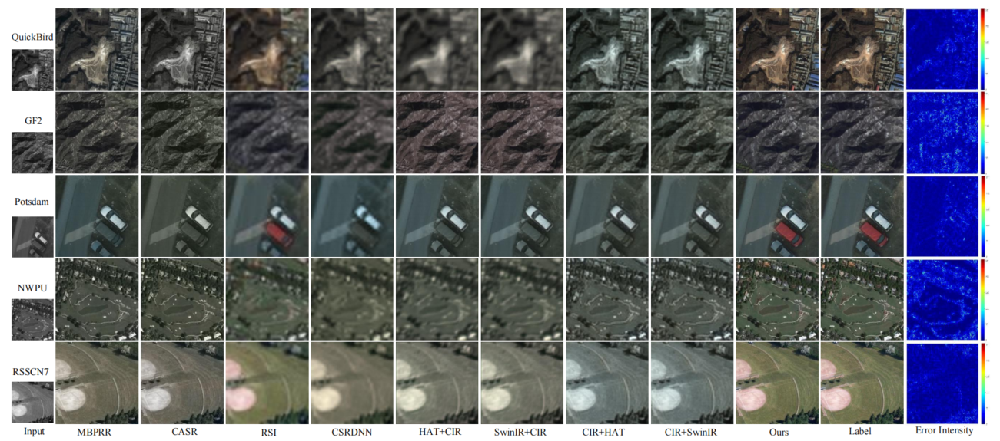
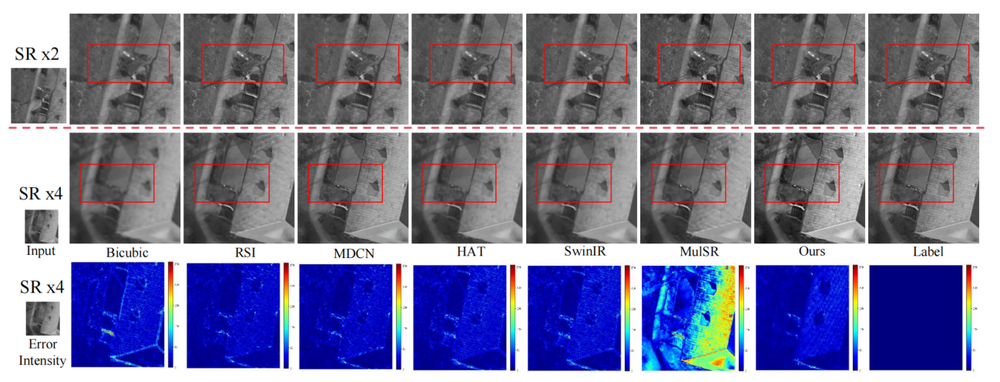
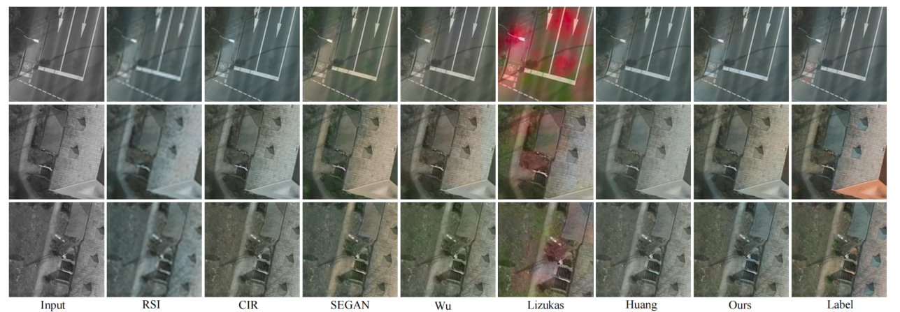

# MFmamba
This repository contains the **official implementation** of the paper   *"MFmamba: A Multi-function Network for Panchromatic Image Resolution Restoration Based on State-Space Model"*.
# 🌟 MFmamba: A Multi-function Network for Panchromatic Image Resolution Restoration Based on State-Space Model

---

## 📸 Overview

We designed a novel multi-function model **MFmamba** to realize the tasks of SR, spectral recovery, joint SR and spectral recovery through three different inputs.    

💡 **MFmamba** utilizes UNet++ as the backbone, and a **Mamba Upsample Block (MUB)** is combined with UNet++. Secondly, a **Dual Pool Attention (DPA)** is designed to replace the skip connection in UNet++. Finally, a **Multi-scale Hybrid Cross Block (MHCB)** is proposed for initial feature extraction.

<p align="center">
  
</p>

---


## 📸 Data preparation
Taking the Potsdam dataset as an example Potsdam  
    >>--train    
    >>--val  
    >>--test   


## 📸 train
2.Train
Put the training/val/test data into the corresponding path in **train.py**.

For Super-Resolution and Colorization task：

```bash
python train.py --task colorx2 --img_train_path ../../../../data/Potsdam_Original/train/label/ --img_test_path ../../../../data/Potsdam_Original/test/label/

```

For Super-Resolution task：
```bash
python train.py --task srx2 --img_train_path ../../../../data/Potsdam_Original/train/label/ --img_test_path ../../../../data/Potsdam_Original/test/label/
```

For Colorization task：
```bash
python train.py --task color --img_train_path ../../../../data/Potsdam_Original/train/label/ --img_test_path ../../../../data/Potsdam_Original/test/label/
```
  
## 📸 test
3.Test
Put the training/val/test data into the corresponding path in **test.py**.

The pre trained model generated during the training process follows the **./log_1/pkl/best**. 

For Super-Resolution and Colorization task：
```bash
python test.py --task colorx2 --best_pkl_path ./log/pkl/best/best.pkl
```

For Super-Resolution and Colorization task：
```bash
python test.py --task srx2 --best_pkl_path ./log/pkl/best/best.pkl
```

For Super-Resolution and Colorization task：
```bash

python test.py --task color --best_pkl_path ./log/pkl/best/best.pkl
```

The Pre-Train model can get here. [pre-train model](https://pan.baidu.com/s/1ghTCKOnyHOki6U0I0mX1WA?pwd=12SR)  Extract code: 12SR  


## 📸 Overview

We designed a novel multi-function model **MFmamba** to realize the tasks of SR, spectral recovery, joint SR and spectral recovery through three different inputs.    

## 📸 Result of Joint SR and Spectral Recovery
<p align="center">
  
</p>

## 📸 Result of Super-Resolution

<p align="center">
  
</p>

## 📸 Result of Spectral Recovery
<p align="center">
  
</p>
---
